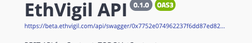
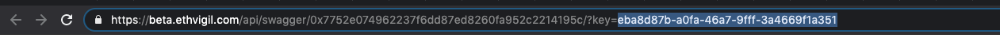

## Walkthrough of the coding approach

Go through these blog posts if you wish to understand some of the design decisions in creating the app. The coding effort was the outcome of a two-part developer jam organized by BlockVigil in Bangalore 🇮🇳

[Part 1: BlockVigil Developer Updates — Kicking off 2020 with Websocket integrations for Ethereum](https://medium.com/blockvigil/blockvigil-developer-updates-kicking-off-2020-with-websocket-integrations-for-ethereum-de38cd145656)

[Part 2: BlockVigil Developer Jam #2 Updates](https://medium.com/blockvigil/blockvigil-developer-jam-2-updates-a723a759f42d)

## Before you begin

1. [Sign up for an EthVigil Beta developer account](https://beta.ethvigil.com/)
2. Deploy the Solidity code found in `TODOcontract.sol`. [Deployment instructions here](https://ethvigil.com/docs/web_onboarding/)
3. Note down the following:
    * Deployed contract address
    * API(write) key
    * API(read) key

For now, to get the API(read) key, just click on the link to the `swagger.json` for this contract and copy the value after `/?key=` appended to the URL. Refer to screenshots below.




## Configuring the project

Copy the file `rollup.config.example.js` to `rollup.config.js`. Find the following lines and enter the values as you noted down in the previous step.

```
process.env.API_KEY = process.env.API_KEY || 'WRITE-API-KEY-HERE';
process.env.API_READ_KEY = process.env.API_READ_KEY || 'READONLY-API-KEY-HERE';
process.env.TODO_CONTRACT_ADDRESS = process.env.TODO_CONTRACT_ADDRESS || '0xContractAddress'
```

## Running the project

```bash
npm install
npm run dev
```

Open up [localhost:3000/todo](http://localhost:3000/todo) and start clicking around.

## Bugs and feedback

hello@blockvigil.com
